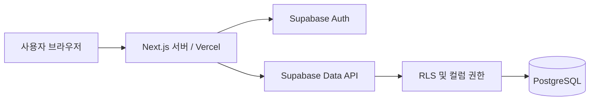
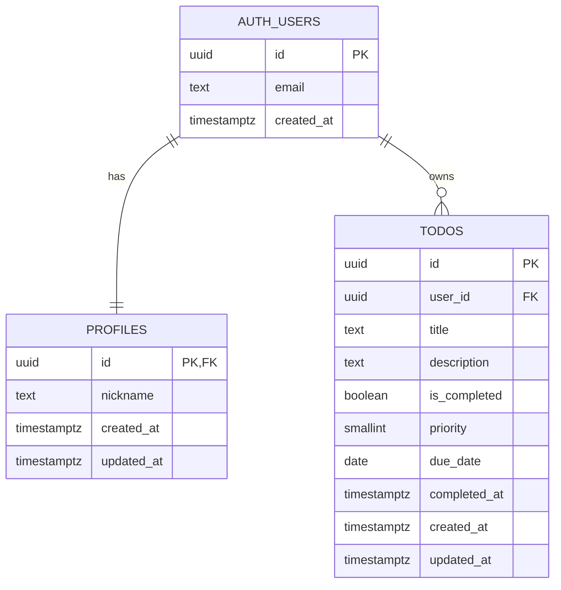

# Todo List 개발 기준서

문서 버전: 1.0 · 작성일: 2026-10-08 · 상태: 개발 전 통합 기준안

이 문서는 `README_CLAUDE.md`와 `README_GPT.md`의 기능, 데이터 구조, 인증, 화면, 배포 기준을 통합한 개발 명세다. 이메일로 가입한 사용자가 자신의 할 일을 관리하는 웹 서비스를 대상으로 한다.

아래의 **초기 필수 범위**를 첫 배포의 완료 기준으로 사용한다. 선택 확장은 별도 작업으로 구현하며, 채택할 때 관련 화면·DB·권한·검증 기준을 함께 반영한다. 이 문서는 구현된 프로그램이나 실행 검증 결과를 뜻하지 않는다.

## 목차

1. [기능 범위와 통합 결정](#1-기능-범위와-통합-결정)
2. [기술과 버전 관리](#2-기술과-버전-관리)
3. [시스템 구조와 처리 책임](#3-시스템-구조와-처리-책임)
4. [프로젝트 폴더 구성](#4-프로젝트-폴더-구성)
5. [화면과 사용자 흐름](#5-화면과-사용자-흐름)
6. [입력과 Todo 동작 규칙](#6-입력과-todo-동작-규칙)
7. [초기 DB 설계](#7-초기-db-설계)
8. [권한과 데이터 보호](#8-권한과-데이터-보호)
9. [인증과 세션](#9-인증과-세션)
10. [카테고리 선택 확장](#10-카테고리-선택-확장)
11. [환경 설정](#11-환경-설정)
12. [프로젝트 생성과 로컬 실행](#12-프로젝트-생성과-로컬-실행)
13. [개발 순서와 변경 관리](#13-개발-순서와-변경-관리)
14. [배포와 운영](#14-배포와-운영)
15. [검증과 완료 기준](#15-검증과-완료-기준)
16. [참고 자료와 문서 유지](#16-참고-자료와-문서-유지)

## 1. 기능 범위와 통합 결정

### 1.1 초기 필수 범위

| 기능 | 개발 기준 |
|---|---|
| 회원가입 | 이메일, 비밀번호, 비밀번호 확인, 닉네임 입력 |
| 이메일 인증 | 인증 링크 확인 후 로그인 세션 생성, 만료·오류 안내 및 재발송 |
| 로그인·로그아웃 | 인증된 이메일과 비밀번호로 로그인, 현재 브라우저 세션 로그아웃 |
| 로그인 유지 | 유효한 세션을 갱신하며 새로고침 후에도 유지 |
| 프로필 | 가입 시 프로필 자동 생성, Todo 화면에 본인 닉네임 표시 |
| Todo 추가·조회·수정·삭제 | 본인 소유 데이터만 처리, 삭제 전 확인 |
| 완료 상태 | 미완료↔완료 변경과 완료 시각 기록 |
| 우선순위 | 낮음·보통·높음, 기본값 보통 |
| 마감일 | 날짜 단위 선택 입력, 지난 마감일 표시 |
| 목록 필터 | 전체·미완료·완료 |
| 페이지 이동 | 페이지당 20개, 생성 시각 내림차순 |
| UI | 모바일·데스크톱 반응형, 로딩·빈 목록·오류·처리 중 상태 |
| 배포 | Vercel에서 운영, 운영용 Supabase와 연동 |

### 1.2 선택 확장과 후속 기능

| 구분 | 기능 | 적용 원칙 |
|---|---|---|
| 선택 확장 | 카테고리 생성·수정·삭제, Todo 분류·필터 | 10장의 전체 기준을 적용한 뒤 제공 |
| 후속 기능 | 닉네임 수정, 아바타 | 화면과 해당 컬럼·권한을 함께 추가 |
| 후속 기능 | 비밀번호 재설정, 회원 탈퇴 | 별도 인증·계정 관리 작업으로 진행 |
| 후속 기능 | 소셜 로그인, 공동 목록, 파일 첨부, 실시간 동기화 | 요구사항 확정 후 데이터·권한 설계를 재검토 |

### 1.3 두 원본 사이의 차이에 대한 결정

| 항목 | 통합 기준 |
|---|---|
| Todo 식별자 | `UUID`로 통일하고 DB에서 생성 |
| 프로필 | 초기에는 닉네임만 저장·표시. 아바타 컬럼은 기능 도입 시 추가 |
| 우선순위·완료 시각 | 초기 DB와 UI 동작에 포함 |
| 카테고리 | 초기 필수 테이블에서 제외하고 별도 마이그레이션으로 도입 |
| 페이지 이동 | 초기 필수, 페이지당 20개 |
| 소스 위치 | `src/` 사용 |
| 서버 변경 처리 | `src/actions/`의 Server Actions로 통일 |
| 요청 단계 처리 | Next.js 16의 `src/proxy.ts` 사용 |
| 입력 제한 | 6장의 규칙을 화면·서버·DB 명세에 일관되게 적용 |

## 2. 기술과 버전 관리

| 구분 | 사용 기준 | 역할 |
|---|---|---|
| 언어 | TypeScript, strict 모드 | 데이터 형식과 코드 오류 검사 |
| 실행 환경 | Node.js 22.x, npm | 로컬·CI·Vercel의 런타임 계열 통일 |
| 프레임워크 | Next.js 16.x, App Router | 라우팅, 서버 렌더링, Server Actions |
| UI | Next.js와 호환되는 React·React DOM | 폼, 목록, 버튼 구성 |
| 스타일 | Tailwind CSS 4.x | 공통 스타일과 반응형 화면 |
| UI 보조 | shadcn/ui 선택 | 필요할 때 공통 UI 구현에 사용 |
| DB·인증 | Supabase PostgreSQL, Supabase Auth | 데이터 저장, 이메일 인증, 세션 |
| Supabase SDK | `@supabase/supabase-js`, `@supabase/ssr` | 사용자 세션에 따른 서버·브라우저 연결 |
| 입력 검증 | Zod | 공통 입력 스키마 |
| 검사 | ESLint, TypeScript | 코드 품질·타입 검사 |
| 테스트 | Vitest, Playwright, Supabase DB 테스트 | 입력 규칙·사용자 흐름·RLS 검증 |
| 배포 | Vercel | 웹 서비스와 환경 변수 관리 |

위 버전은 이 프로젝트의 선택 기준이다. 최초 구성 시 호환되는 세부 버전을 설치하고 `package-lock.json`을 커밋한다. 이후 설치는 `npm ci`를 사용한다. 로컬과 CI의 정확한 Node.js 버전은 `.nvmrc`에 기록하고, `package.json`의 `engines.node`와 Vercel 설정은 `22.x`로 맞춘다. Vercel의 세부 패치 버전은 플랫폼이 관리한다. [Vercel Node.js 버전](https://vercel.com/docs/functions/runtimes/node-js/node-js-versions)

Next.js 생성 도구의 기본 선택을 그대로 가정하지 않는다. 이 프로젝트는 `src/`, App Router, TypeScript, ESLint, Tailwind를 사용하고 초기에는 React Compiler와 Cache Components를 사용하지 않는다. 버전 변경 시 인증·빌드·검사 절차를 함께 검증한다. [Next.js 설치](https://nextjs.org/docs/app/getting-started/installation)

## 3. 시스템 구조와 처리 책임



| 구성 | 책임 |
|---|---|
| Server Components | 로그인 확인, 본인 프로필·Todo 목록 조회 |
| Client Components | 입력, 필터·페이지 조작, 처리 중 상태와 결과 안내 |
| Server Actions | 사용자 검증 → 입력 검증 → 사용자 세션으로 DB 변경 → 결과 확인 → 화면 갱신 |
| 인증 Route Handler | 이메일 토큰 검증, 세션 쿠키 설정, 인증 결과 이동 |
| Proxy | 요청·응답 쿠키를 통한 세션 갱신과 필요한 화면 이동 |
| PostgreSQL | 제약 조건, 소유자 격리, 생성·수정·완료 시각 관리 |

초기 Todo 조회·변경은 Next.js 서버를 경유한다. 그래도 공개 API를 직접 호출하는 경우를 고려해 DB 권한과 RLS를 독립적으로 적용한다. 화면 이동이나 버튼 숨김을 데이터 접근 통제의 근거로 삼지 않는다.

Supabase 서버 클라이언트는 요청별 쿠키로 생성하고 사용자의 세션을 전달한다. 개인 데이터나 인증 쿠키가 포함된 응답은 공용 캐시·정적 페이지로 재사용하지 않는다. 인증 상태가 바뀌면 화면의 사용자 데이터도 다시 조회한다. [Supabase SSR](https://supabase.com/docs/guides/auth/server-side/creating-a-client?framework=nextjs)

## 4. 프로젝트 폴더 구성

아래는 초기 구현에서 갖춰야 할 구조다. 아직 생성된 소스 목록을 뜻하지 않는다.

```text
todo-list/
├── public/
├── src/
│   ├── app/
│   │   ├── layout.tsx
│   │   ├── page.tsx
│   │   ├── globals.css
│   │   ├── (auth)/
│   │   │   ├── login/page.tsx
│   │   │   └── signup/
│   │   │       ├── page.tsx
│   │   │       └── check-email/page.tsx
│   │   ├── auth/
│   │   │   ├── confirm/route.ts
│   │   │   └── error/page.tsx
│   │   └── (protected)/
│   │       └── todos/
│   │           ├── page.tsx
│   │           ├── loading.tsx
│   │           └── error.tsx
│   ├── components/
│   │   ├── auth/
│   │   ├── todos/
│   │   └── ui/
│   ├── actions/
│   │   ├── auth.ts
│   │   └── todos.ts
│   ├── lib/
│   │   ├── supabase/
│   │   │   ├── client.ts          # 브라우저용 클라이언트
│   │   │   ├── server.ts          # 요청별 서버 클라이언트
│   │   │   └── update-session.ts  # Proxy의 세션 갱신 헬퍼
│   │   ├── auth.ts               # 공통 사용자 검증
│   │   ├── queries/todos.ts      # 목록 조회와 페이지 계산
│   │   └── validations/
│   │       ├── auth.ts
│   │       └── todo.ts
│   ├── types/
│   │   ├── database.ts           # DB에서 생성한 타입
│   │   └── action-result.ts      # 화면에 전달할 결과 타입
│   └── proxy.ts
├── supabase/
│   ├── config.toml
│   ├── templates/confirmation.html
│   ├── migrations/               # 테이블·권한·정책·함수·트리거
│   └── tests/                    # DB 제약과 접근 권한 테스트
├── tests/
│   ├── unit/
│   └── e2e/
├── .env.example
├── .env.local                    # 저장소 제외
├── .gitignore
├── .nvmrc
├── eslint.config.mjs
├── next.config.ts
├── postcss.config.mjs
├── vitest.config.ts
├── playwright.config.ts
├── package.json
├── package-lock.json
├── tsconfig.json
└── README.md
```

괄호 폴더는 경로를 정리하는 용도이며 `(protected)`라는 이름 자체로 인증이 적용되지는 않는다. 페이지와 변경 처리에서 사용자 검증을 수행한다. Supabase 브라우저 클라이언트는 브라우저 측 SDK가 필요한 기능에서만 사용한다.

Tailwind v4는 `@tailwindcss/postcss` 설정과 `globals.css`의 `@import "tailwindcss";`를 기준으로 한다. 공통 색상·간격·타이포그래피를 정의해 화면마다 반복되는 스타일을 통일한다. [Tailwind Next.js 가이드](https://tailwindcss.com/docs/installation/framework-guides/nextjs)

## 5. 화면과 사용자 흐름

| 화면 | URL | 내용과 이동 기준 |
|---|---|---|
| 시작 | `/` | 인증된 사용자는 `/todos`, 그 외에는 `/login` |
| 회원가입 | `/signup` | 이메일·비밀번호·확인·닉네임 입력 |
| 이메일 확인 안내 | `/signup/check-email` | 확인 안내, 이메일 재입력·재발송, 로그인 이동 |
| 로그인 | `/login` | 이메일·비밀번호 입력 |
| 이메일 인증 처리 | `/auth/confirm` | 토큰 검증 후 `/todos` 또는 `/auth/error` |
| 인증 오류 | `/auth/error` | 만료·무효 링크 안내, 재발송 안내 화면과 로그인 링크 |
| Todo 목록 | `/todos` | 본인 닉네임, 로그아웃, 추가·수정·삭제·완료·필터·페이지 이동 |

인증된 사용자가 `/login` 또는 `/signup`에 접근하면 `/todos`로 이동한다. 비로그인 사용자의 `/todos` 접근은 `/login`으로 이동한다. 이메일 안내·오류 화면은 세션 없이도 접근할 수 있다.

Todo 추가 폼은 목록 상단에 두고 수정은 항목 내부 편집 폼으로 통일한다. 취소하면 수정 전 표시로 돌아가고, 저장에 실패하면 입력을 유지한다. 삭제 확인에는 해당 제목을 표시한다.

화면은 360px 너비와 데스크톱에서 주요 작업을 수행할 수 있어야 한다. 입력에는 label을 연결하고 키보드 포커스를 표시한다. 완료·우선순위·마감 상태는 색상과 텍스트를 함께 사용한다. 처리 결과와 오류는 보조 기술로도 인식할 수 있게 제공한다.

## 6. 입력과 Todo 동작 규칙

### 6.1 입력 검증

| 항목 | 기준 | 검증 위치 |
|---|---|---|
| 이메일 | 앞뒤 공백 제거, 유효한 이메일 형식 | 화면·서버·Supabase Auth |
| 가입 비밀번호 | 최소 8자, 앞뒤 공백을 임의로 제거하지 않음 | 화면·서버·Supabase Auth 설정 |
| 비밀번호 확인 | 비밀번호와 동일, Auth·DB로 저장하지 않음 | 화면·서버 |
| 닉네임 | 앞뒤 공백 제거 후 1~30자, 공백만 불가, 사용자 간 중복 허용 | 화면·서버·프로필 생성 트리거·DB |
| 제목 | 앞뒤 공백 제거 후 1~200자, 공백만 불가 | 화면·서버·DB |
| 설명 | 선택, 최대 2,000자, 공백만 있으면 `NULL`, 내용의 줄바꿈 유지 | 화면·서버·DB |
| 우선순위 | 정수 1·2·3만 허용, 기본값 2 | 화면·서버·DB |
| 마감일 | 선택, 실제 존재하는 `YYYY-MM-DD` 날짜. 과거 날짜 허용 | 화면·서버·DB |
| 완료 상태 | 명시적인 boolean 목표값 | 서버·DB |
| Todo ID | 유효한 UUID, 변경 대상 식별에만 사용 | 서버·DB |

문자 수는 유니코드 코드 포인트 기준으로 센다. 서버 검증에서는 JavaScript의 UTF-16 길이와 혼동하지 않도록 구현하고 DB의 `char_length`와 맞춘다. DB에도 길이·범위·공백 전용 문자열 거부 제약을 적용하며, 서버 정규화와 같은 결과가 나오는지 경계값을 확인한다.

생성 요청은 `title`, `description`, `priority`, `due_date`만 받는다. 수정 요청은 변경 가능한 입력과 대상 `id`만 받는다. 소유자·생성 시각·수정 시각·완료 시각은 요청값으로 받지 않는다. 설명은 일반 텍스트로 표시한다.

### 6.2 목록·필터·페이지

| 항목 | 기준 |
|---|---|
| URL 상태 | `/todos?status=all&page=1` |
| 필터 값 | `all`, `active`, `completed` |
| 잘못된 쿼리 | 알 수 없는 필터는 `all`, 양의 정수가 아닌 페이지는 1로 정규화 |
| 정렬 | `created_at DESC, id DESC`; 우선순위는 표시용이며 기본 정렬을 바꾸지 않음 |
| 페이지 크기 | 20개 고정, 서버에서 범위 조회 |
| 건수 | 같은 소유자·필터 조건으로 전체 건수 계산 |
| 필터 변경 | 1페이지로 이동 |
| 추가 성공 | 전체 목록의 1페이지로 이동해 새 항목 표시 |
| 수정·완료 변경 | 현재 필터와 페이지를 유지해 재조회. 조건에서 벗어난 항목은 목록에서 제거 |
| 삭제·상태 변경 후 빈 페이지 | 마지막 유효 페이지로 보정. 결과가 0개면 1페이지의 빈 목록 표시 |
| 범위를 넘는 페이지 | 마지막 유효 페이지로 정규화 |

초기에는 페이지 번호 기반 조회를 사용한다. 동시에 새 항목이 추가·삭제되면 페이지 경계가 바뀔 수 있으며, 장시간 조회의 고정 스냅샷은 제공하지 않는다. 여러 탭의 수정은 마지막으로 성공한 필드 변경이 반영되는 기준으로 두고, 수정 폼은 자신이 담당하는 필드만 전송한다.

### 6.3 완료와 날짜

- 새 Todo는 미완료이며 `completed_at`은 `NULL`이다.
- 미완료에서 완료로 바뀌면 DB가 `completed_at`에 현재 시각을 기록한다.
- 완료에서 미완료로 바뀌면 `completed_at`을 `NULL`로 만든다.
- 다시 완료하면 가장 최근 완료 전환 시각을 기록한다. 과거 완료 이력은 저장하지 않는다.
- 이미 완료인 항목에 완료를 다시 요청하면 기존 완료 시각을 유지한다. 서버에서 단순 반전 연산을 하지 않고 목표 상태를 저장한다.
- 마감일은 시간대 변환 없이 날짜 그대로 표시한다. 미완료이고 마감일이 사용자의 현지 날짜보다 이전이면 ‘기한 지남’으로 표시한다.
- 생성·수정·완료 시각은 `timestamptz`로 저장하고 사용자 브라우저 시간대에 맞춰 표시한다. 서버와 브라우저가 다른 시간대로 날짜를 계산하지 않도록 날짜 표시 책임을 일관되게 둔다.

### 6.4 처리 결과

처리 중에는 해당 폼이나 버튼의 중복 제출을 막는다. DB 변경에 성공한 뒤 목록과 건수를 다시 조회한다. 초기에는 서버 응답을 확인한 후 결과를 반영한다.

수정·삭제 대상 행이 반환되지 않으면 ‘항목을 찾을 수 없거나 접근할 수 없습니다’로 안내한다. 같은 목표 상태를 다시 저장하는 요청은 대상 행이 확인되면 정상 처리할 수 있다. 네트워크·검증·세션 오류를 구분하되 DB 내부 오류 내용은 사용자에게 그대로 노출하지 않는다.

## 7. 초기 DB 설계

### 7.1 ERD



`auth.users`는 Supabase Auth가 관리한다. 가입·비밀번호·계정 처리는 Auth API를 사용하고, 애플리케이션 테이블에는 비밀번호를 저장하지 않는다. 프로필은 계정 생성 트리거로 생성하여 신규 계정의 1:1 관계를 보장한다. [Supabase 사용자 데이터 관리](https://supabase.com/docs/guides/auth/managing-user-data)

### 7.2 `public.profiles`

| 컬럼 | 타입 | 제약 | 기본값·관리 |
|---|---|---|---|
| `id` | uuid | PK, FK → `auth.users.id`, `ON DELETE CASCADE` | 가입 계정의 ID |
| `nickname` | text | NOT NULL, 1~30자, 공백만 불가 | 가입 시 입력 |
| `created_at` | timestamptz | NOT NULL | DB `now()` |
| `updated_at` | timestamptz | NOT NULL | 생성 시 `now()`, 변경 시 DB 갱신 |

초기 화면은 본인 프로필 조회만 제공한다. 일반 사용자에게 프로필 INSERT·UPDATE·DELETE 권한은 주지 않는다. 닉네임 수정 기능을 도입할 때 UPDATE 권한을 `nickname`에만 추가한다.

### 7.3 `public.todos`

| 컬럼 | 타입 | 제약 | 기본값·관리 |
|---|---|---|---|
| `id` | uuid | PK, NOT NULL | DB `gen_random_uuid()` |
| `user_id` | uuid | NOT NULL, FK → `auth.users.id`, `ON DELETE CASCADE` | DB `auth.uid()` |
| `title` | text | NOT NULL, 1~200자, 공백만 불가 | 사용자 입력 |
| `description` | text | NULL 허용, 최대 2,000자 | `NULL` |
| `is_completed` | boolean | NOT NULL | `false` |
| `priority` | smallint | NOT NULL, `CHECK (priority BETWEEN 1 AND 3)` | `2` |
| `due_date` | date | NULL 허용 | `NULL` |
| `completed_at` | timestamptz | NULL 허용, 완료 상태와 일치 | DB 트리거 |
| `created_at` | timestamptz | NOT NULL | DB `now()` |
| `updated_at` | timestamptz | NOT NULL | 생성 시 `now()`, 변경 시 DB 갱신 |

완료 상태와 완료 시각의 일치 조건은 다음 DB 제약으로 보장한다.

```sql
CHECK (
  (is_completed AND completed_at IS NOT NULL)
  OR (NOT is_completed AND completed_at IS NULL)
)
```

인덱스는 전체 목록용 `(user_id, created_at DESC, id DESC)`와 상태 필터용 `(user_id, is_completed, created_at DESC, id DESC)`를 둔다. 정렬과 필터 조건은 6.2절과 일치시킨다.

### 7.4 함수·트리거 계약

| 이름·대상 | 시점 | 필수 동작 |
|---|---|---|
| `on_auth_user_created` / `auth.users` | AFTER INSERT | `NEW.id`로 프로필 생성, 닉네임 정규화·검증 |
| `set_todo_state` / `todos` | BEFORE INSERT OR UPDATE | 6.3절에 따라 완료 시각을 설정·유지·초기화 |
| `set_updated_at` / `todos`, `profiles` | BEFORE UPDATE | 실제 저장 내용이 바뀐 경우에만 `updated_at` 갱신 |

프로필 생성 함수는 필요한 권한으로 실행하되 `SECURITY DEFINER` 사용 시 고정된 안전한 `search_path`와 명시적 스키마명을 사용한다. 일반 사용자에게 함수의 직접 실행 권한을 주지 않는다. `user_metadata`의 닉네임은 검증되지 않은 입력으로 취급하고 권한 판단에는 사용하지 않는다. 트리거가 실패하면 가입도 실패할 수 있으므로 잘못된 닉네임과 정상 가입을 모두 검증한다. 기존 계정이 있는 DB에 도입할 때는 누락 프로필의 보완도 마이그레이션에 포함한다. [프로필 트리거 안내](https://supabase.com/docs/guides/auth/managing-user-data)

## 8. 권한과 데이터 보호

### 8.1 테이블·컬럼 권한

초기 테이블을 생성하는 마이그레이션에서 기존 `anon`, `authenticated` 권한을 정리한 뒤 아래 권한만 부여한다. `anon`은 초기 애플리케이션 테이블에 접근할 수 없다.

| 테이블 | `authenticated` 권한 |
|---|---|
| `profiles` | SELECT |
| `todos` | SELECT, DELETE; INSERT(`title`, `description`, `priority`, `due_date`); UPDATE(`title`, `description`, `priority`, `due_date`, `is_completed`) |

일반 사용자는 Todo의 `id`, `user_id`, `created_at`, `updated_at`, `completed_at`을 직접 지정·변경할 수 없다. 이 필드들은 DB 기본값과 트리거가 관리한다. UPDATE 테이블 전체 권한을 남겨두면 컬럼 제한의 의도를 충족하지 못하므로, 실제 부여된 권한까지 검사한다. [Supabase 컬럼 권한](https://supabase.com/docs/guides/database/postgres/column-level-security)

### 8.2 RLS 정책

초기 `public.profiles`, `public.todos`에 RLS를 활성화하고, 정책의 적용 역할은 `authenticated`로 지정한다.

| 테이블·작업 | 기존 행 조건 `USING` | 새 행 조건 `WITH CHECK` |
|---|---|---|
| profiles SELECT | `(select auth.uid()) = id` | 해당 없음 |
| todos SELECT | `(select auth.uid()) = user_id` | 해당 없음 |
| todos INSERT | 해당 없음 | `(select auth.uid()) = user_id` |
| todos UPDATE | `(select auth.uid()) = user_id` | `(select auth.uid()) = user_id` |
| todos DELETE | `(select auth.uid()) = user_id` | 해당 없음 |

권한은 작업 가능 여부를, RLS는 접근 가능한 행을 제한한다. 작업별 정책을 명시적으로 작성하고 UPDATE에 필요한 SELECT 정책도 함께 둔다. `auth.uid()` 기본값 자체는 접근 권한 검사를 대신하지 않는다. [Supabase RLS](https://supabase.com/docs/guides/database/postgres/row-level-security)

### 8.3 서버 처리

서버는 각 조회·변경에서 사용자를 검증하고, 조회 조건에도 소유자 ID를 명시한다. Server Actions는 허용한 필드만 DB로 전달한다. Supabase 연결은 공개용 키와 현재 사용자의 세션을 사용한다. `service_role` 또는 secret 키를 일반 사용자 Todo 처리에 사용하지 않는다.

비밀번호, 토큰, 쿠키, 인증 링크 전체를 로그에 남기지 않는다. 오류 로그는 작업 종류·오류 코드·추적용 요청 ID 중심으로 기록한다.

## 9. 인증과 세션

### 9.1 회원가입과 이메일 인증

1. 입력을 검증하고 Supabase Auth의 이메일·비밀번호 가입을 요청한다. 닉네임은 가입 메타데이터로 전달한다.
2. 계정 생성 트리거가 검증된 닉네임으로 프로필을 생성한다.
3. 이메일 확인이 켜진 상태에서 인증 이메일을 발송하고 `/signup/check-email`로 이동한다.
4. 이메일 링크는 `/auth/confirm`에 `token_hash`와 허용한 인증 유형을 전달한다.
5. Route Handler가 `verifyOtp`로 검증하고 세션 쿠키를 설정한다.
6. 성공하면 토큰이 없는 `/todos` 주소로 이동하고, 실패하면 `/auth/error`로 이동한다.

이 프로젝트는 token hash 확인 방식을 사용한다. 가입·재발송의 `emailRedirectTo`는 서버가 `APP_URL`로 구성한 `/auth/confirm` 주소로 고정하고, Supabase의 허용 주소에 등록한다. 가입 확인 이메일 템플릿은 다음 링크 구조를 사용한다.

```html
<a href="{{ .RedirectTo }}?token_hash={{ .TokenHash }}&amp;type=email">이메일 인증하기</a>
```

`APP_URL`에는 경로나 쿼리가 없는 환경별 기본 주소를 설정한다. 앱은 `emailRedirectTo`를 반드시 전달하며 요청자가 준 외부 이동 주소를 채택하지 않는다. 초기 인증 확인 경로는 `type=email`만 허용하고 성공 목적지는 `/todos`로 고정한다. 이메일 템플릿·허용 주소·처리 경로를 한 세트로 검증한다. [Supabase 이메일 템플릿](https://supabase.com/docs/guides/auth/auth-email-templates), [Redirect URL 설정](https://supabase.com/docs/guides/auth/redirect-urls)

### 9.2 예외 흐름

| 상황 | 처리 기준 |
|---|---|
| 가입·재발송 요청 접수 | 계정 존재 여부를 불필요하게 드러내지 않는 공통 안내 |
| 이메일 미인증 로그인 | 이메일 확인·재발송 안내 |
| 링크 만료·이미 사용·잘못된 토큰 | 인증 오류 안내, 재발송·로그인 선택 제공 |
| 이메일 재발송 | 이메일을 다시 입력받아 검증. 성공 후 UI에서 최소 60초 대기, 실제 서버 제한도 적용 |
| 요청 제한 도달 | 서버의 재시도 가능 안내를 반영하고 반복 제출 억제 |
| 세션 만료 후 저장 | 성공으로 처리하지 않고 재로그인 안내. 이동 전에 작성 내용 보존·복사 기회 제공 |
| Auth·DB·네트워크 장애 | 재시도 안내, 비밀번호를 제외한 입력 유지 |

재발송 UI의 대기 시간만으로 요청 제한을 구현하지 않는다. Supabase Auth와 이메일 제공자의 제한을 설정·확인한다. 인증 이메일은 운영 SMTP로 발송하고 로컬에서는 Supabase가 제공하는 테스트 메일함을 사용한다. [Supabase SMTP](https://supabase.com/docs/guides/auth/auth-smtp)

### 9.3 로그인·로그아웃과 검증

서버는 `getClaims()`로 토큰을 검증하거나 최신 사용자 정보가 필요한 경우 `getUser()`를 사용한다. `getSession()`에서 읽은 사용자 정보만으로 권한을 결정하지 않는다. Proxy의 세션 갱신 외에 페이지·Server Actions에서도 검증한다. [Supabase 서버 인증](https://supabase.com/docs/guides/auth/server-side/creating-a-client?framework=nextjs)

로그아웃은 현재 브라우저 세션을 대상으로 처리하고 `/login`으로 이동한다. 이후 화면 데이터도 비워서 다른 계정으로 로그인할 때 이전 사용자의 목록이 보이지 않게 한다. JWT 만료 전까지의 토큰 효력 등 세션 무효화 특성을 고려하며, 모든 기기의 즉시 로그아웃은 초기 기능으로 약속하지 않는다.

## 10. 카테고리 선택 확장

이 장은 카테고리를 채택할 때만 적용한다. 초기에는 `categories` 테이블과 `todos.category_id`를 생성하지 않는다.

### 10.1 화면과 동작

Todo 화면 안에 본인 카테고리의 생성·이름 및 색상 수정·삭제 기능을 추가한다. Todo는 카테고리가 없거나 본인 카테고리 하나에 속한다. 카테고리 필터는 완료 상태 필터와 함께 적용하며 변경 시 1페이지로 이동한다. 카테고리가 삭제되면 Todo는 남고 분류만 해제된다.

### 10.2 확장 스키마

| `public.categories` 컬럼 | 타입·제약·기본값 |
|---|---|
| `id` | uuid PK, `gen_random_uuid()` |
| `user_id` | uuid NOT NULL, `auth.uid()`, FK → `auth.users.id ON DELETE CASCADE` |
| `name` | text NOT NULL, 앞뒤 공백 제거 후 1~50자, 공백만 불가 |
| `color` | text NOT NULL, `#RRGGBB` 형식, 기본값 `#64748b` |
| `created_at` | timestamptz NOT NULL, `now()` |
| `updated_at` | timestamptz NOT NULL, `now()`, 내용 변경 시 트리거 갱신 |

동일 사용자 안에서 정규화된 이름은 중복되지 않아야 한다. 초기 확장은 대소문자를 구분하는 `UNIQUE(user_id, name)` 기준으로 한다. 컬럼 조합 참조를 위해 `UNIQUE(user_id, id)`도 둔다.

`todos`에는 nullable `category_id uuid`를 추가하고 아래 관계를 적용한다.

```sql
FOREIGN KEY (user_id, category_id)
REFERENCES public.categories (user_id, id)
ON DELETE SET NULL (category_id)
```

이 복합 외래키는 Todo와 카테고리의 소유자가 같도록 보장한다. 삭제 시 `category_id`만 비우고 필수 `user_id`는 유지한다. 대상 PostgreSQL에서 해당 구문을 검증한 마이그레이션으로 제공한다. 단일 `category_id → categories.id` 참조만으로 대체하지 않는다. [PostgreSQL 외래키와 삭제 동작](https://www.postgresql.org/docs/current/ddl-constraints.html)

### 10.3 권한·검증 변경

- `categories`에 RLS를 활성화하고 Todo와 동일하게 작업별 소유자 조건을 적용한다.
- 일반 사용자에게 SELECT·DELETE와 INSERT/UPDATE(`name`, `color`)만 부여한다.
- `todos.category_id`의 INSERT·UPDATE 컬럼 권한을 추가한다.
- 서버에서 선택한 카테고리가 본인 것인지 검증하고, DB 복합 외래키로도 강제한다.
- `(user_id, category_id, created_at DESC, id DESC)` 인덱스를 추가하고 조회 성능을 확인한다.
- 확장 검증은 타인 카테고리 연결 거부, 중복 이름 거부, 분류 해제, 삭제 후 필터 보정, 상태 필터와의 조합을 포함한다.

## 11. 환경 설정

### 11.1 애플리케이션 환경 변수

`.env.example`에는 아래 항목과 설명을 제공한다. 실제 값은 `.env.local` 또는 Vercel의 환경별 설정에 등록한다.

```dotenv
NEXT_PUBLIC_SUPABASE_URL=YOUR_SUPABASE_PROJECT_URL
NEXT_PUBLIC_SUPABASE_PUBLISHABLE_KEY=YOUR_SUPABASE_PUBLISHABLE_KEY
APP_URL=http://localhost:3000
```

| 항목 | 관리 기준 |
|---|---|
| `NEXT_PUBLIC_SUPABASE_URL` | 해당 환경의 Supabase 주소 |
| `NEXT_PUBLIC_SUPABASE_PUBLISHABLE_KEY` | 공개용 키. 해당 환경에서 legacy anon 키를 쓰는 경우 이 값에 넣되 관리자 키와 혼동하지 않음 |
| `APP_URL` | 이 프로젝트가 정의한 서버용 설정 이름. Next.js·Supabase가 자동으로 인식하는 표준 변수는 아님 |

환경 변수는 서버 시작·빌드 시 형식과 누락 여부를 검사한다. `.env*`의 실제 값은 Git에서 제외하고 `.env.example`은 예외로 커밋한다.

### 11.2 Supabase와 환경별 설정

| 설정 | 기준 |
|---|---|
| 이메일 가입 | 이메일·비밀번호 방식 활성화, 이메일 확인 활성화 |
| 추가 로그인 방식 | 초기에는 익명 로그인·소셜 로그인 비활성화 |
| 비밀번호 정책 | 최소 8자를 앱 검증과 일치시킴 |
| Site URL | 해당 환경의 기본 웹 주소 |
| Redirect URLs | 앱이 보내는 `/auth/confirm` 주소를 환경별로 등록 |
| 가입 확인 템플릿 | 9.1절과 동일한 token hash 방식 |
| SMTP | 운영·외부 테스트 발송용 SMTP와 발신자 설정 |
| 로컬 Auth 설정 | `supabase/config.toml`과 `templates/confirmation.html`에 반영 |

로컬은 로컬 Supabase, Preview는 개발·검증용 Supabase, Production은 운영 Supabase를 사용한다. Preview에 운영 DB 자격 정보를 넣지 않는다. 인증 검증에는 고정된 Preview 별칭 도메인을 우선 사용하고 환경의 `APP_URL`·허용 주소·이메일 도착 주소를 일치시킨다.

## 12. 프로젝트 생성과 로컬 실행

이 절은 구현자가 프로젝트를 구성한 뒤 재현 가능한 실행 절차를 제공하기 위한 계약이다. 명령만 실행하면 이 문서의 모든 기능이 자동 구현되는 것은 아니다.

### 12.1 최초 프로젝트 생성

Node.js 22.x, npm, Git, Docker 호환 컨테이너 런타임을 준비한다. 새로운 프로젝트 디렉터리를 만들 위치에서 다음을 실행한다.

```bash
npx create-next-app@16 todo-list --ts --tailwind --eslint --app --src-dir --use-npm --import-alias "@/*"
cd todo-list
npm install @supabase/supabase-js @supabase/ssr zod
npm install --save-dev supabase vitest @playwright/test
npx supabase init
```

추가 질문이 나오면 2장의 선택을 적용한다. 생성된 패키지의 Next.js·Tailwind 메이저 버전을 확인하고 버전 파일·검사 설정·환경 예제를 구성한다. Supabase CLI는 프로젝트의 개발 의존성으로 관리한다. [Supabase CLI 시작](https://supabase.com/docs/guides/local-development/cli/getting-started)

초기 마이그레이션을 생성하고 7~8장의 스키마·권한·함수·트리거를 작성한다. 로컬 인증 설정과 이메일 템플릿도 작성한다.

```bash
npx supabase migration new init_todo_schema
```

`migration new`는 파일을 생성하는 명령이다. SQL 내용을 작성하고 검토한 다음 로컬 DB에 적용한다.

### 12.2 구현된 저장소를 받은 개발자의 실행 순서

1. 저장소를 내려받아 프로젝트 루트로 이동하고 `.nvmrc`의 Node.js를 사용한다.
2. 의존성을 설치하고 Docker 호환 런타임을 실행한다.
3. 로컬 Supabase를 시작하고 마이그레이션을 적용한다.
4. 환경 예제를 복사해 로컬 URL·공개용 키를 채운다.
5. 개발 서버를 실행한다.

```bash
npm ci
npx supabase start
npx supabase migration up --local
npx supabase status
cp .env.example .env.local
```

`supabase status`에 표시되는 로컬 API 주소와 공개용 키를 `.env.local`에 입력한다. `APP_URL`은 `http://localhost:3000`으로 맞춘 후 실행한다.

```bash
npm run dev
```

[로컬 앱](http://localhost:3000)에서 가입하고, CLI에 표시되는 로컬 테스트 메일함에서 인증 메일을 확인한다. 로컬 전체 재생성이 필요할 때만 `npx supabase db reset --local`을 사용한다. 이 명령은 로컬 데이터를 삭제하고 마이그레이션을 다시 적용하므로 일상적인 실행 단계에는 포함하지 않는다. [Supabase CLI 명령](https://supabase.com/docs/reference/cli/supabase-migration-up)

### 12.3 구현해야 할 스크립트

다음 스크립트와 이에 필요한 설정·테스트 파일을 프로젝트에 제공한다.

```json
{
  "scripts": {
    "dev": "next dev",
    "build": "next build",
    "start": "next start",
    "lint": "eslint .",
    "typecheck": "next typegen && tsc --noEmit",
    "test": "vitest run",
    "test:e2e": "playwright test",
    "test:db": "supabase test db",
    "db:types": "supabase gen types typescript --local --schema public > src/types/database.ts"
  }
}
```

DB 타입은 로컬 마이그레이션 적용 후 생성하고 스키마와 함께 커밋한다. 타입 검사는 `next typegen`으로 경로 타입을 먼저 생성한 뒤 수행한다. [Next.js 타입 생성](https://nextjs.org/docs/app/api-reference/cli/next#next-typegen-options)

Playwright 실행 전 `npx playwright install`로 브라우저를 설치하며, CI에서는 필요한 OS 의존성도 준비한다. 브라우저 테스트는 운영 DB를 사용하지 않는다.

Next.js 16에서는 빌드와 lint 검사를 별도로 실행한다. 테스트 설정은 단위 테스트와 브라우저 테스트의 파일 경로를 구분해 서로 잘못 수집하지 않도록 한다. [Next.js 검사 설정](https://nextjs.org/docs/app/getting-started/installation#set-up-linting)

## 13. 개발 순서와 변경 관리

| 단계 | 산출물 | 통과 기준 |
|---|---|---|
| 1. 기반 구성 | 프로젝트, 버전·환경 예제, 검사 설정 | 로컬 개발 서버와 기본 검사 실행 |
| 2. DB·권한 | 초기 마이그레이션, DB 타입, DB 테스트 | 프로필 자동 생성, 제약·권한·RLS 검증 |
| 3. 인증 | 가입·확인·로그인·로그아웃·재발송 | 정상·만료·실패·세션 갱신 흐름 검증 |
| 4. Todo | CRUD, 우선순위, 마감일, 완료 시각 | 본인 데이터 처리와 DB 저장 규칙 검증 |
| 5. 목록·UI | 필터·페이지·반응형·오류 상태 | 경계 페이지와 실패 후 입력 유지 검증 |
| 6. 통합 검증 | 단위·DB·브라우저 테스트 | 두 계정 격리와 초기 완료 기준 충족 |
| 7. 배포 | 운영 DB·Auth 설정, Vercel 배포 | 실제 서비스 주소에서 핵심 흐름 확인 |

테이블, 권한, RLS, 함수, 트리거, 인덱스 변경은 `supabase/migrations/`에 기록한다. 이미 적용한 마이그레이션을 수정하지 않고 새 파일로 변경한다. 원격 DB의 수동 변경을 정상 개발 경로로 사용하지 않는다. [Supabase 마이그레이션](https://supabase.com/docs/guides/deployment/database-migrations)

코드 리뷰에는 기능 요구사항, DB 변경, 실패 시 동작, 검증 결과를 포함한다. 기능 범위가 바뀌면 기능표·화면·스키마·정책·완료 기준을 같은 변경에서 갱신한다.

## 14. 배포와 운영

1. 코드 품질·타입·단위·DB·브라우저 검사와 배포용 빌드를 통과시킨다.
2. 운영 Supabase 프로젝트에 이메일 인증·SMTP·Site URL·Redirect URLs·템플릿을 설정한다.
3. 적용할 DB 변경과 연결된 프로젝트를 확인하고, 필요한 백업·복구 방법을 확인한다.
4. 운영 DB에 마이그레이션을 적용한다.
5. Vercel에 Git 저장소를 연결하고 Production 환경 변수와 Node.js 계열을 맞춘다.
6. 배포 후 실제 주소에서 가입 → 메일 인증 → 로그인 → Todo 저장 → 새로고침 → 로그아웃을 검증한다.

원격 마이그레이션은 프로젝트 연결 후 적용 목록을 확인하고 진행한다.

```bash
npx supabase login
npx supabase link --project-ref YOUR_PROJECT_REF
npx supabase migration list
npx supabase db push --dry-run
npx supabase db push
```

`YOUR_PROJECT_REF`는 배포 대상 프로젝트 ID로 바꾼다. 테스트 데이터는 운영에 넣지 않는다. DB 마이그레이션과 웹 배포는 별도 작업이므로, 운영 중에는 기존 앱과 호환되는 DB 변경을 먼저 적용한다. 웹 배포를 되돌려도 DB 변경은 자동으로 되돌아가지 않는다. [Supabase 원격 마이그레이션](https://supabase.com/docs/guides/deployment/database-migrations)

환경 변수 변경은 새 배포에 반영하고, 인증 주소가 바뀌면 관련 Auth 설정도 함께 갱신한다. 운영에서는 인증 실패·이메일 발송 실패·서버 오류를 확인할 수 있어야 한다. 백업 기능과 복구 절차는 선택한 Supabase 요금제·설정에 맞춰 기록한다.

## 15. 검증과 완료 기준

### 15.1 검사 방법

| 계층 | 주요 검사 |
|---|---|
| 단위 테스트 | 입력 경계값, 문자열 정규화·문자 수, 날짜, 필터·페이지 계산 |
| DB 테스트 | 제약 조건, 컬럼 권한, RLS, 트리거, 완료 시각, 계정 삭제 연쇄 |
| 브라우저 테스트 | 가입·인증·로그인, CRUD, 필터·페이지, 오류 안내, 로그아웃 |
| 수동 확인 | 모바일·데스크톱, 키보드 사용, 운영 이메일과 배포 주소 |

DB 접근 권한은 관리자 연결만으로 확인하지 않는다. 테스트 안에서 일반 사용자 역할과 각 계정의 인증 정보를 적용하고, 실제 로그인한 두 계정으로도 검증한다. DB 테스트용 관리자 권한은 테스트 환경의 준비 작업에만 사용한다.

### 15.2 초기 필수 체크리스트

- [ ] 신규 가입 시 본인 프로필이 정확히 한 개 생성되고 닉네임이 표시된다.
- [ ] 이메일 확인 전에는 Todo에 접근할 수 없다.
- [ ] 이메일 인증 성공·실패·만료·재사용·재발송 흐름이 정의대로 동작한다.
- [ ] 로그인·새로고침·세션 갱신·현재 브라우저 로그아웃이 동작한다.
- [ ] 로그아웃 및 계정 전환 후 이전 사용자의 데이터가 표시되지 않는다.
- [ ] Todo 추가·조회·수정·완료 변경·삭제가 저장 후 새로고침에도 유지된다.
- [ ] 우선순위의 기본값과 허용 범위, 마감일 표시가 일치한다.
- [ ] 완료·미완료·재완료·같은 상태 재요청 시 완료 시각이 규칙대로 유지된다.
- [ ] 제목 0·1·200·201자, 설명 2,000·2,001자, 공백만 있는 입력, 이모지 포함 입력을 검증한다.
- [ ] 비로그인은 API를 직접 호출해도 프로필·Todo를 조회하거나 변경할 수 없다.
- [ ] A 계정은 B의 Todo ID를 알아도 조회·수정·삭제할 수 없다.
- [ ] 타인 소유 생성과 ID·소유자·생성·수정·완료 시각의 직접 지정·변경이 거부된다.
- [ ] 일반 사용자의 프로필 직접 생성·수정·삭제가 거부된다.
- [ ] 대상이 없거나 권한이 없어서 수정·삭제가 이루어지지 않으면 성공으로 표시하지 않는다.
- [ ] 전체·미완료·완료 필터와 20개 단위 페이지 이동이 동작한다.
- [ ] 생성 시각이 같아도 정렬이 일정하고, 필터 변경·범위 초과·마지막 행 삭제 후 페이지가 보정된다.
- [ ] 로딩·빈 목록·조회 실패·저장 실패를 구분하고 저장 실패 시 입력을 유지한다.
- [ ] 360px 모바일과 데스크톱, 키보드만 사용하는 환경에서 주요 작업이 가능하다.
- [ ] 테스트 계정을 삭제하면 그 프로필과 Todo가 함께 삭제된다.
- [ ] 새 로컬 DB에 마이그레이션을 적용하면 같은 스키마·권한이 재현된다.
- [ ] lint·타입 검사·단위 테스트·DB 테스트·브라우저 테스트·배포용 빌드가 통과한다.
- [ ] 운영 주소와 실제 인증 이메일로 핵심 사용자 흐름을 확인한다.

### 15.3 카테고리 채택 시 추가 체크리스트

- [ ] 본인 카테고리 CRUD와 Todo 분류·해제가 동작한다.
- [ ] 타인 카테고리를 직접 지정하는 요청이 서버와 DB에서 거부된다.
- [ ] 동일 사용자·동일 이름 중복은 거부하고 다른 사용자의 같은 이름은 허용한다.
- [ ] 카테고리 삭제 후 Todo와 소유자는 유지되고 `category_id`만 비워진다.
- [ ] 카테고리·완료 상태 필터 조합과 페이지 보정이 동작한다.

카테고리를 채택하지 않은 첫 배포에는 15.3절을 완료 조건으로 적용하지 않는다.

## 16. 참고 자료와 문서 유지

기술 확인 기준일은 2026-10-08이다. 본문에 연결한 Next.js·Tailwind·Supabase·PostgreSQL·Vercel 공식 문서를 구현 시 참고한다. 원본 문서의 기능 선택과 이 문서에서 정한 제품 규칙은 공식 서비스의 기본값과 구분한다.

프로젝트를 구현할 때 이 문서를 저장소의 `README.md`로 사용하고 실제 저장소 주소, 설치된 버전, 배포 주소, 테스트 실행 결과를 추가한다. 완료 전 항목은 체크하지 않는다. 요구사항이 바뀌면 문서 버전·변경일을 갱신하고, 관련 스키마·권한·테스트가 함께 변경되었는지 확인한다.
